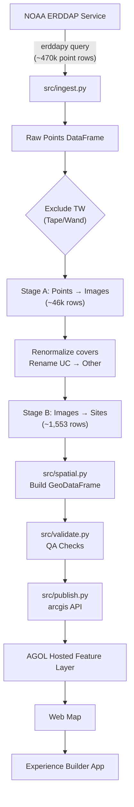

# CRCP Benthic Explorer

An automated Python pipeline that queries NOAA's [ERDDAP](https://www.ncei.noaa.gov/erddap/) service for Coral Reef Conservation Program (CRCP) benthic cover annotation data, aggregates it from point-level to site-year summaries, and publishes the results as an ArcGIS Online Hosted Feature Layer powering an interactive [Experience Builder](https://experience.arcgis.com/) web application.

## Architecture



## Data Source

The pipeline ingests data from NOAA's CRCP benthic cover ERDDAP datasets. Each dataset contains point-level annotations from stratified random underwater photo surveys (10 random points per image, classified into a 3-tier benthic taxonomy).

| Region | ERDDAP Dataset ID | Source |
|--------|-------------------|--------|
| Hawaiian Archipelago | `CRCP_Benthic_Cover_Hawaii` | [ERDDAP](https://www.ncei.noaa.gov/erddap/tabledap/CRCP_Benthic_Cover_Hawaii.html) |
| Mariana Archipelago | `CRCP_Benthic_Cover_CNMI_Guam` | [ERDDAP](https://www.ncei.noaa.gov/erddap/tabledap/CRCP_Benthic_Cover_CNMI_Guam.html) |
| American Samoa | `CRCP_Benthic_Cover_American_Samoa` | [ERDDAP](https://www.ncei.noaa.gov/erddap/tabledap/CRCP_Benthic_Cover_American_Samoa.html) |
| Pacific Remote Island Areas | `CRCP_Benthic_Cover_PRIAs` | [ERDDAP](https://www.ncei.noaa.gov/erddap/tabledap/CRCP_Benthic_Cover_PRIAs.html) |

## Repository Structure

```
crcp_benthic_explorer/
├── README.md
├── requirements.txt
├── .gitignore
├── config/
│   └── sources.json              # ERDDAP source registry
├── data/
│   ├── raw/                      # (gitignored)
│   └── processed/                # (gitignored)
├── docs/
│   └── agol_setup_guide.md       # AGOL / Experience Builder config steps
├── src/
│   ├── __init__.py
│   ├── config.py                 # Source configuration loader
│   ├── ingest.py                 # ERDDAP query client
│   ├── transform.py              # Point → Image → Site aggregation
│   ├── spatial.py                # GeoDataFrame construction & coord QA
│   ├── publish.py                # ArcGIS Online publishing
│   └── validate.py               # Data quality checks
├── notebooks/
│   ├── 01_data_exploration.ipynb  # Data profiling & taxonomy review
│   ├── 02_pipeline_demo.ipynb     # Full pipeline end-to-end
│   └── 03_publish_to_agol.ipynb   # Publish & verify on AGOL
├── toolbox/
│   └── CRCPBenthicExplorer.pyt   # ArcGIS Pro Python Toolbox
└── tests/
    ├── fixtures/
    │   └── sample_points.csv      # Synthetic test data
    ├── test_ingest.py
    ├── test_transform.py
    └── test_validate.py
```

## Setup

### Prerequisites

- Python 3.9+
- An ArcGIS Online organizational account (for publishing)
- ArcGIS Pro (optional, for the `.pyt` toolbox)

### Installation

```bash
git clone https://github.com/<your-username>/crcp_benthic_explorer.git
cd crcp_benthic_explorer
python -m venv venv
source venv/bin/activate
pip install -r requirements.txt
```

### Environment Variables

Create a `.env` file (gitignored) or export directly:

```bash
export AGOL_USERNAME="your_agol_username"
export AGOL_PASSWORD="your_agol_password"
# Optional: export AGOL_URL="https://your-org.maps.arcgis.com"
```

## Usage

### Run the full pipeline

```python
from src import ingest, transform, spatial, validate, publish

# 1. Ingest
points = ingest.fetch_source("hawaii")

# 2. Transform
sites = transform.run_full_transform(points)

# 3. Build spatial features
gdf = spatial.build_site_geodataframe(sites)
spatial.validate_coordinates(gdf, "hawaii")

# 4. Validate
validate.validate_sites(gdf)

# 5. Publish to ArcGIS Online
url = publish.publish_site_summary(gdf, "hawaii")
print(f"Published: {url}")
```

Or run the pipeline notebooks interactively:

```bash
jupyter notebook notebooks/02_pipeline_demo.ipynb
```

### Run tests

```bash
python -m pytest tests/ -v
```

### Add a new region

1. Add an entry to `config/sources.json` with the ERDDAP `dataset_id`.
2. Run the pipeline with the new source id.
3. Create a Web Map and Experience Builder page for the new region.

No code changes required.

## Pipeline Details

### Transform Stages

**Stage A: Points → Images** — Groups the ~470k point annotations by image, computes percent cover at three taxonomy tiers (tier_1 functional groups, tier_2 subcategories, tier_3 genera), excludes Tape/Wand (TW) artifacts, renormalises to 100%, and renames Unclassified (UC) to "Other".

**Stage B: Images → Sites** — Groups images by (site, year), computes mean and standard deviation of every cover metric, selects a representative survey photo (the image closest to the site mean coral cover), and carries forward reef zone, depth bin, and coordinate metadata.

### Taxonomy (3-tier hierarchy)

| Tier 1 | Example Tier 2 | Example Tier 3 |
|--------|----------------|----------------|
| CORAL | BR (Branching), MASS (Massive), ENC (Encrusting) | POCS (Pocillopora), POMA (Porites massive) |
| TURF | TURFH (Turf on hard), TURFR (Turf on rubble) | — |
| MA (Macroalga) | UPMA (Upright), EMA (Encrusting) | HALI (Halimeda), LOBO (Lobophora) |
| CCA | CCAH, CCAR | — |
| SED (Sediment) | SAND, FINE | — |
| SC (Soft Coral) | OCTO (Octocoral) | — |
| I (Invertebrate) | SP (Sponge), ZO (Zoanthid) | — |
| Other | UNK, SHAD | — |

## License

This project uses publicly available data from NOAA's Coral Reef Conservation Program.
Data is in the public domain as a U.S. Government work.
